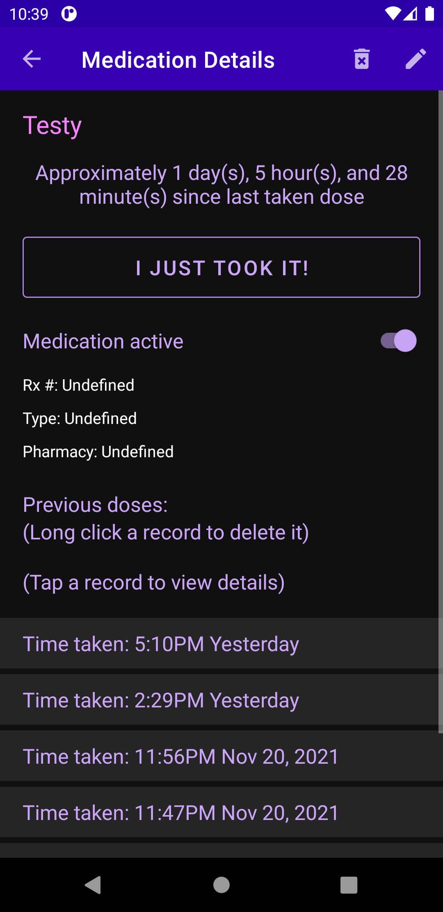

## Did I Take My Meds?

## About

Did I Take My Meds? helps keep track of when to take medications. It is designed to help prevent a user from skipping doses and/or overdosing.

Did I Take My Meds? allows a user save multiple medications with complex schedules. Each medication can trigger an independent reminder notification. Additionally, this application allows a user to record when they take a dose. As a part of a medication routine, this app can help prevent overdoses and skipped doses.

---

## Screenshots

---
## Credits
Brazilian Portuguese translations by [mezysinc](https://github.com/mezysinc) and [lnux-usr](https://github.com/lnux-usr)

German translations by [jpameli](https://github.com/jpameli)

French translations by [Edanas](https://hosted.weblate.org/user/Edanas/)

Hebrew translations by [Yaron](https://hosted.weblate.org/user/Yaron/)

Chinese Simplified translations by [luxu](https://hosted.weblate.org/user/luxu/)

Spanish translations by [sguinetti](https://hosted.weblate.org/user/sguinetti/0) and [caos30](https://hosted.weblate.org/user/caos30/)

Catalan translations by [caos30](https://hosted.weblate.org/user/caos30/)

Bug fix by [johannes87](https://github.com/johannes87)

***Is your name missing from this list?***  
If so, please submit an issue or send me an email at noahstandingford@gmail.com and I will correct it

---

## License
Files in this project are licensed GPLv3+ unless otherwise indicated. Some icon resources are licensed under the Apache License v2

---
Google Play and the Google Play logo are trademarks of Google LLC.
